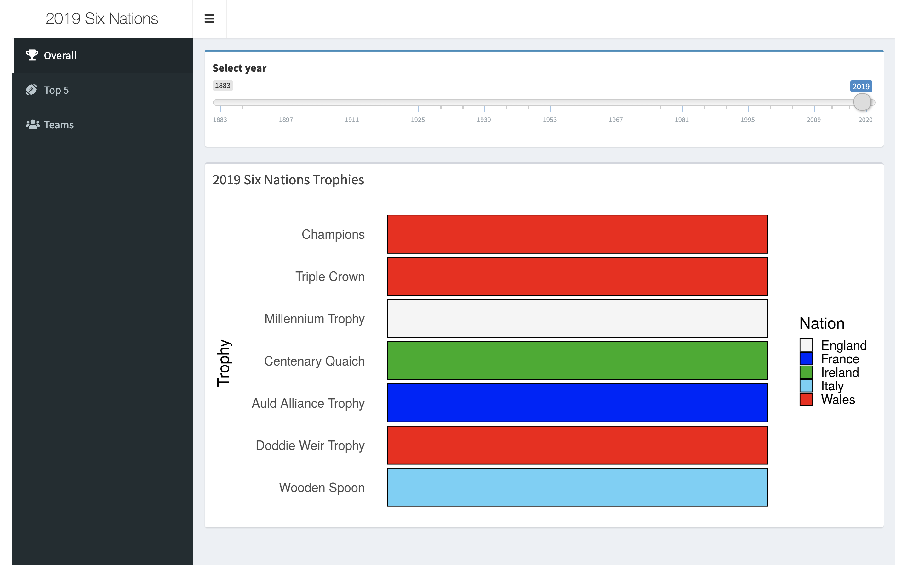
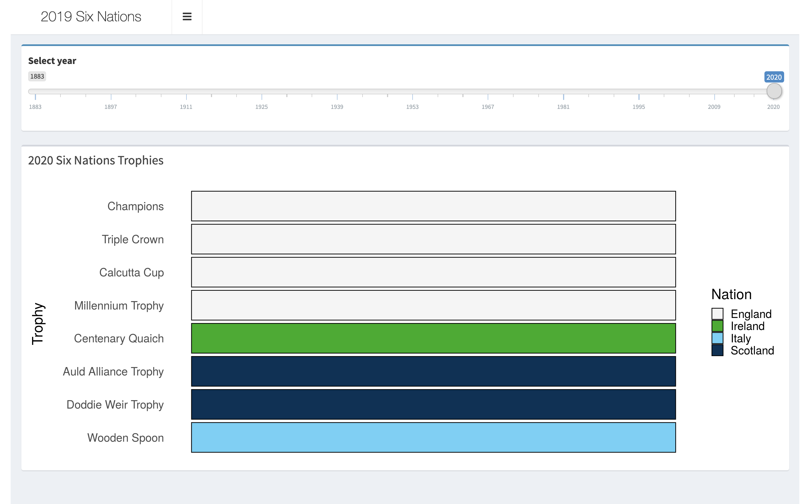
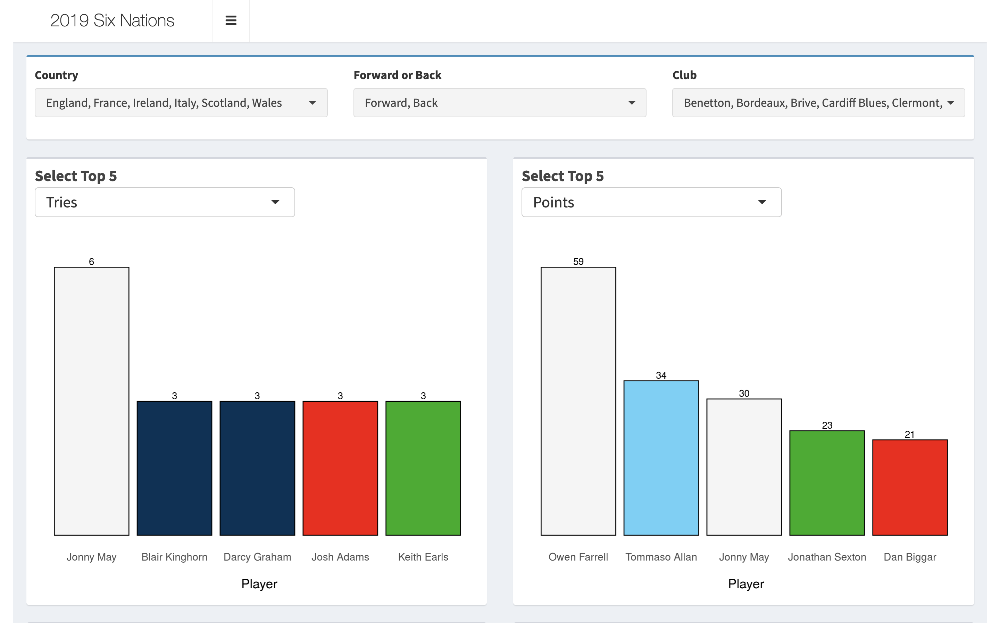
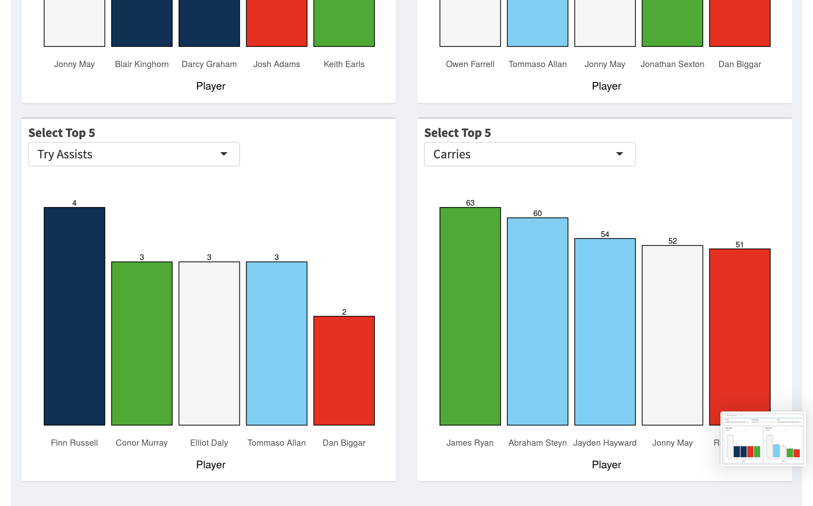
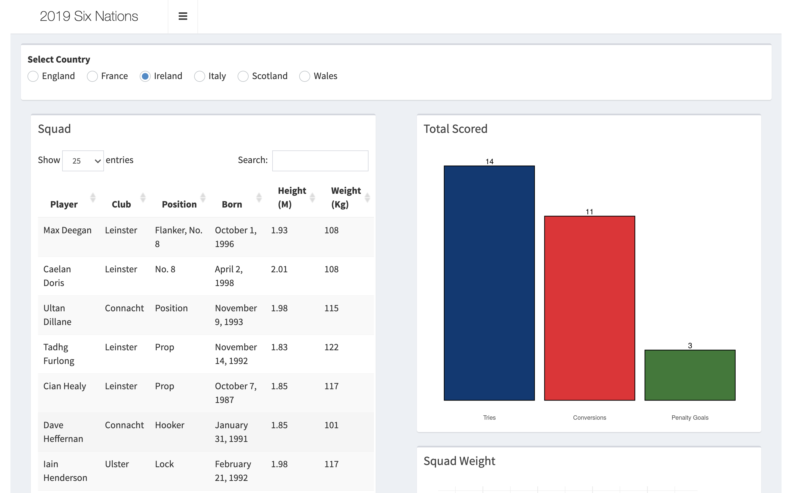
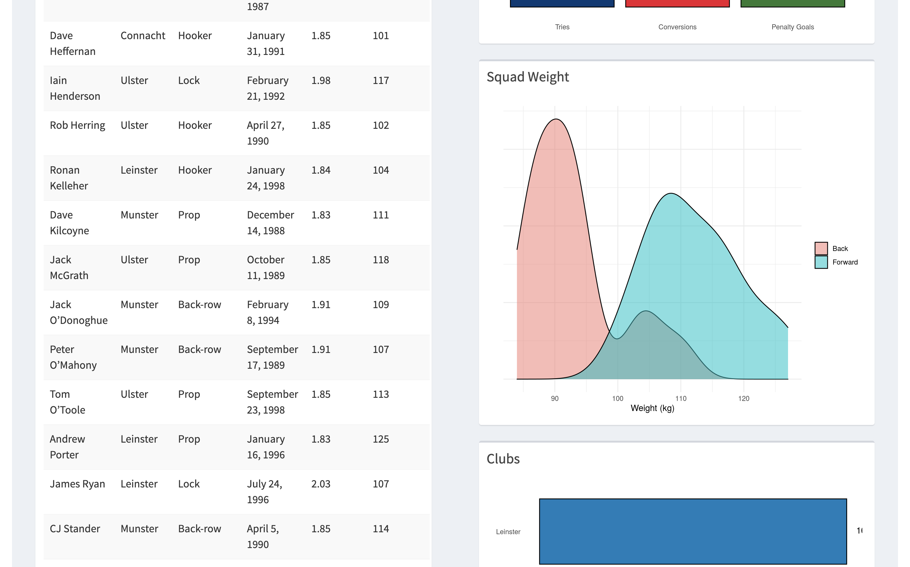
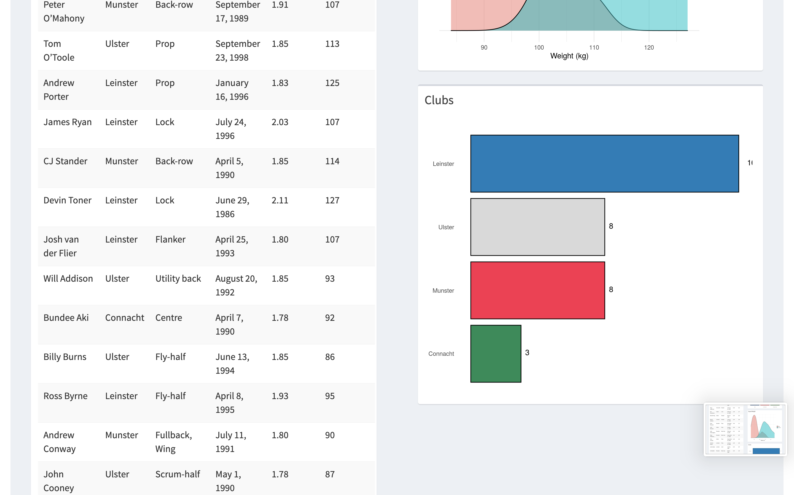

# Six Nations App
## Authors
### Harry Williams    

## Six Nations App

The app can be found at this [link](https://hgw2.shinyapps.io/weekend_homework/)

## Introduction

The Six Nations Championship is an annual Rugby Union tournemnet where the Home Nations (England, Scotland, Wales and Ireland) and France and Italy all play each other once. As well as the overall championship there are a number of different trophies that are also completed for throughout the tournment.

### The App

The App consists of three tabs

**Overall** - A rundown of the winners of the trophies awarded that year from the start im 1883 - 2020

**Top 5** - The Top 5 Players from a varity of user selected variables from the 2019 Tournement

**Teams** - A breakdown of the 6 teams from 2019

## Contents
 * [Raw data](raw_data) - Raw data sourced from Kaggle
 
 * [Cleaning script](cleaning_scripts)  - Scripts to clean the data

 * [Clean Data](clean_data) - Clean Data used in the app

## Images

 
## Data
#### Data was sourced using open source data from the 2019 Six Nations Championship found on [Kaggle](https://www.kaggle.com/cianmcgovernleahy/six-nations-historical-data). 

## Requirements
Project made in R.  

### Packages

| Package      | Version    
| :------------- | :----------: 
|dplyr|1.0.2|
|forcats|0.5.0
|ggplot2|3.3.2
|here| 0.1  
|shinyWidgets| 0.5.4  
|purrr|0.3.3  
|readr|1.3.1
|shiny|1.5.0
|shinydashboard|0.7.1 
|stringr|1.4.0 
|tidyr|1.1.2
|tidyverse|1.3.0 

